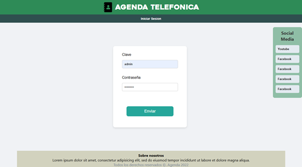
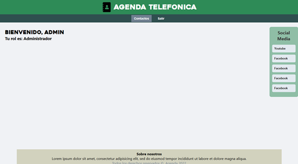
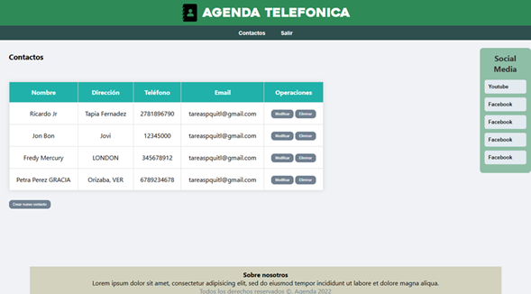
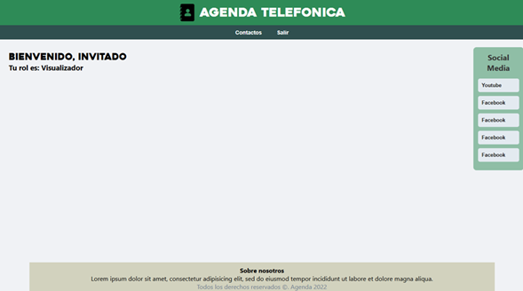
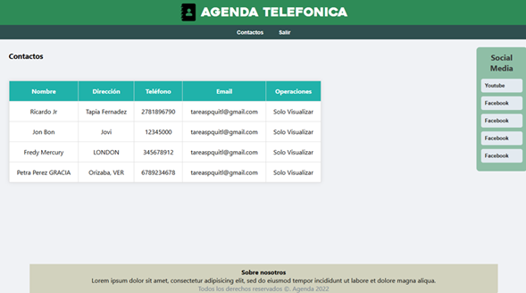

CRUD Contactos

**Instrucciones de instalación y ejecución**

Requisitos previos:
- Un servidor local (XAMPP)
- PHP 7.4 o superior
- MySQL

Instalación:
1. Haga una copia del repositorio o descarga los archivos del proyecto.
https://github.com/vicenhr/agendaContactos
2. Coloca la carpeta del proyecto dentro del directorio `htdocs` de XAMPP.
3. Iniciar Apache y MySQL desde el panel de control en XAMPP.
4. Importar el archivo SQL:
   - Abrir `phpMyAdmin`
   - Crear una base de datos llamada `contactos`
   - Ejecutar el script de creación de tablas y datos iniciales proporcionado

Ejecución:
1. Abre tu navegador y accede a:  
   `http://localhost/[nombre_carpeta_proyecto]/index.php`
2. Ingresar ahora con alguno de los siguientes usuarios:
   - Administrador  
     Usuario: `admin`  
     Contraseña: `admin123`

   - Visualizador
     Usuario: `invitado`  
     Contraseña: `invitado123`

---

**Descripción breve del proyecto**

Este proyecto consiste en una aplicación desarrollada en PHP, inclyendo sql, javascript, css y obviamente html. La aplicación permite gestionar una lista de contactos y está diseñada para que los usuarios puedan crear, visualizar, modificar y eliminar contactos de forma sencilla.

Este proyecto incluye dos tipos de usuario:
- Administrador: puede realizar todas las operaciones CRUD.
- Visualizador: solo tiene permiso de lectura.

---

**Capturas de pantalla**

Pantalla de inicio de sesión

Mensaje de Bienvenida (Administrador)

Vista de contactos (Administrador)

Mensaje de Bienvenida (Visuzalizador)

Vista de contactos (Visuzalizador)

---

**Información de contacto**

- Nombre: Vicente Hernández Ramos
- Correo electrónico: vicxnte.hr.17@gmail.com
- Télefono: 2722074953
- Institución: Instituto Tecnológico de Orizaba  
- Carrera: Ingeniería en Sistemas Computacionales  
- Fecha: 15 de mayo de 2025

---
